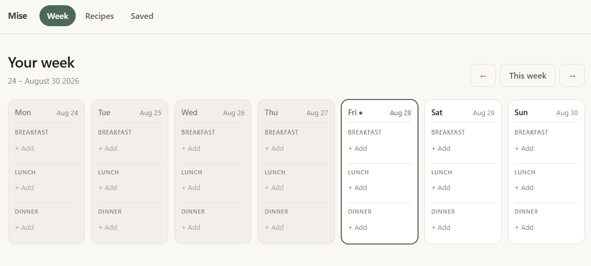
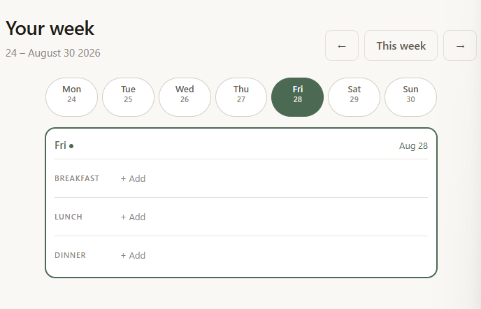

# Mise — weekly meal planner

Plan what you're eating this week. Browse a catalogue of 50 recipes, drop them into
breakfast / lunch / dinner slots on real dates, and bookmark the ones you like.
Everything is saved in your own browser — no account, no server, nothing leaves your machine.

**Live app:** https://thelivinsine.github.io/meal-planner/
**Code:** https://github.com/thelivinsine/meal-planner
**Stack:** one HTML file, one CSS file, one JS file. No frameworks, no build step, no dependencies.

## Where things stand

*Written for picking this up in a new session.*

| | |
|---|---|
| **`main`** | Commit `49b3c16`, the bold-consumer redesign squash-merged from PR [#4](https://github.com/thelivinsine/meal-planner/pull/4). Pages build `built`, live at the link above. The branch `design/bold-consumer` is deliberately **not** deleted |
| **Open work** | PR [#5](https://github.com/thelivinsine/meal-planner/pull/5), direction B — app shell / control surface. It was drafted against the pre-redesign `main` and is now behind it. It needs a rebase or a close; direction A shipping is effectively the decision against it |
| **Deploy** | Merging to `main` triggers a Pages build on its own. Watch it with `gh api repos/thelivinsine/meal-planner/pages/builds/latest --jq .status` until it reads `built` |

**The whole redesign is live and none of it has been seen in a browser.** That is the single most
important thing to know here. Contrast is computed, touch targets are arithmetic, the accordion
and the docked nav have only ever existed as HTML strings in a stub-DOM script. The three defects
that shipped with PR #3 are genuinely fixed — but they were found by reading, and so were the ones
found since, which is not the same as having looked at the thing.

**Next jobs, in the order they'd earn their place:**

1. **Open it in a browser.** Wide, then at 360px, then on a real phone. Everything below this
   line is guesswork until that happens.
2. **Retake the screenshots.** The two in this file are of the pre-redesign app and are now
   actively misleading — the third time this project has had stale shots. Delete or replace.
3. **Settle PR #5.** Rebase it onto the redesign or close it.
4. **Seven small things found in review and left alone**, none of them urgent:
   - Google Fonts is the app's first external request; blocked or offline, you get the fallback
     stack. The one place the "static files only" constraint bends.
   - `applyTheme()` always stamps `data-theme`, so a dark-OS user gets a light app on first
     visit despite `<meta name="color-scheme" content="light dark">`.
   - `<meta name="theme-color">` is light-only, so browser chrome stays cream in dark mode.
   - The storage key `p5:mealplanner` is written twice — `STORAGE_KEY` in `app.js` and again in
     the inline theme script in `index.html`. Change one, forget the other.
   - Toggling Save inside the open recipe dialog rewrites `#detail-tools` and drops keyboard
     focus. Same class as the day-strip defect, in a place nobody checked.
   - `is-upcoming` is emitted by `renderWeek` and matched by no CSS rule.
   - The week's date range line is gone with no replacement; on a wide screen the rails carry
     dates, but there's no longer a single label saying which week you're looking at.

**Two open questions, both yours to call:**

- **The stub-DOM check scripts are still thrown away each session.** This round added 21 more
  assertions to the pile and then deleted them, so a regression between rounds still has nothing
  to catch it. Committing a single `check.mjs` would fix that; it also puts a test file in a repo
  whose constraints say no test framework. Not done either way.
- **`subgrid` has no fallback.** The week's alignment depends on CSS `subgrid` (Chrome 117+,
  Safari 16+, Firefox 71+). On anything older the rows size per card, which degrades to the old
  misalignment rather than to something broken. Worth a fallback only if an old browser matters.

---

## Screenshots

> **Both of these are stale.** They show the app as it was before the bold-consumer redesign
> merged as `49b3c16` — no accordion, no docked nav switch, the old palette and type. They are
> left here only so the change has a before; do not read them as the current app. Retaking them
> is job 2 above.

Two, both of the Week view on an empty plan, taken 28 August 2026, of the *pre-redesign* build.

**The week, wide.** Seven day cards, past days settled grey, Friday carrying today's accent
border and dot, the three meal rows running straight across all seven.



**The week, narrow.** The day strip and the one day it selects — Friday, tinted because it's
selected, the others outlined. This is the first time the narrow week has been seen rendered.



Still missing, and worth taking next: the Recipes view with the filter panel open, and the inline
slot picker under the week with **Add to Thu breakfast** on a card's button.

---

## For anyone reading this without a technical background

**What it does.** Three screens. *Recipes* is the cookbook — search it, filter it, tap a recipe
to read the ingredients and method. *Week* is your plan for the week: seven real days, three
meal slots each. *Saved* is your shortlist of favourites.

**How it saves your plan.** Your browser has a small built-in storage box. The app keeps your
week and your bookmarks there, so closing the tab and coming back later keeps everything.
The catch is that it's per-browser and per-device: your plan on your laptop is not the same plan
as on your phone, and clearing your browsing data clears it. That's the honest trade for having
no accounts and no server to run.

**On a phone.** The seven-day grid can't fit across a phone screen, so it turns into a row of
seven day buttons with one day open below them. The tinted buttons are the days you've already
planned something for, so you can still see the shape of your week at a glance.

**What it deliberately does not do yet.** No shopping list, no month calendar, no adding your own
recipes, no sharing a plan with anyone else. Those are all sensible next steps, not oversights —
see [Not in v1](#not-in-v1).

---

## Running it

Open `index.html` in a browser. That's it — nothing to install.

For a cleaner test of the saving behaviour, serve it over HTTP instead:

```
python -m http.server 8765
```

then visit http://localhost:8765. (Over `file://`, every local page on your machine shares one
storage box, which muddies testing.)

---

## What v1 does

**Recipes**
- 50 recipes, each with tags, cooking time, ingredients and a short method
- Over half are Indian, and roughly three quarters are high-protein; the rest are tagged
  `balanced`. Both are ordinary tags, so the `indian` and `high-protein` chips filter on them
- Search matches recipe names, tags **and** ingredients — so "chickpea" finds the curry
- Filters live in one panel: search, then tag chips grouped under *Macros*, *Meal*, *Diet*,
  *Cuisine & style* and *Main protein* — five short lists instead of one wrap of sixteen
- **Filters** collapses the chips and carries a count badge; an active row underneath names what
  you're filtering by, with **Clear all** beside it
- Pick several chips; a recipe matching any of them shows
- Tapping a card opens a detail panel; close it with the ×, the Escape key, or a tap outside

**Week**
- Monday–Sunday of a real week, with the actual dates shown
- Move between weeks with ← / →, or jump back with **This week**
- Three states are visually distinct: **past** days are greyed and settled, **today** carries an
  accent border and a dot beside the day name, **upcoming** days are clean and white
- The three meal rows line up straight across all seven days, however long a recipe name runs
- Each slot can be filled, replaced, or cleared
- Past days stay editable, so you can log what you actually ate
- **On a narrow screen** seven columns stop fitting, so the week becomes a strip of seven day
  buttons and the one day it selects. The strip is the overview the seven cards give you on a
  wide window: which day you're on, which is today, and which days already have something
  planned (those are tinted). Tap a day to show it. It opens on today when today is in the week
  on screen, Monday otherwise, and it resets that way whenever you move to another week — which
  day you were looking at isn't worth remembering between sessions. The day card itself is the
  same card as the wide layout, with its meal labels beside the meals instead of above them

**Adding a meal — two ways in**

*From the week.* Tap **+ Add** on an empty slot and the recipe list opens in the space below
your week. The day and meal are already known from the slot you tapped, so it never asks again:
the recipes appear as the same cards you get on the Recipes page — name, time, tags, and a
bookmark — except the button reads **Add to Thu breakfast** and fills the slot you tapped. Not
sure about one? Tap the card to read the full recipe; the sheet knows the slot too, so its button
also fills it, and Save sits beside it. There's a search box in the panel, and Escape, the ×, or
moving to another week all close it. This route is for empty slots only — a filled slot is
changed by clearing it and adding again, or through the dialog below.

*From a recipe.* **Add to week** on any card (or in the detail panel) opens a small dialog. The
recipe name is the headline there; "Add to week" sits above it as a small label, and everything
below is centred.
- Pick a day from seven day buttons and a meal from three — everything visible, two taps
- Picking a day that's already gone is allowed but flagged: the dialog says so, and that day's
  button is drawn with a dashed border
- If the slot is taken, the dialog names what's there and the button reads **Replace**

**Saved**
- Exactly the recipes you've bookmarked, from either the card or the detail panel
- Removing a bookmark drops it from Saved immediately but leaves it in your week — unsaving a
  recipe isn't the same as cancelling dinner

---

## How the code is organised

Three files, as the project constraints require:

| File | Contains |
|---|---|
| `index.html` | The page shell: header nav, three `<section>` views, the inline slot picker, two `<dialog>` panels |
| `style.css` | All styling. CSS custom properties for the palette, two width breakpoints (1000px, 620px) and a coarse-pointer block |
| `app.js` | The recipe catalogue, the app state, rendering, and one event handler |

**The data model** is the part worth understanding. Two things exist:

- `RECIPES` — the fixed catalogue, hardcoded. Never saved, never changes at runtime.
- `state` — everything about *you*: which view you're on, which week you're looking at, which
  day is open on a narrow screen (`focusDay`), your plan, your bookmarks, your current search and
  filters, and whether the filter panel is open.
  Only the plan and the bookmarks are saved — the rest is per-session by design.

The plan is one flat object keyed by real date and meal:

```js
state.plan = { '2026-08-26|Dinner': 'chickpea-curry' }
```

Keying by actual date, rather than by "Wednesday", is what makes next week a genuinely separate
plan instead of the same seven slots relabelled. It also means one assignment fills a slot and one
`delete` clears it — no nested structures to walk.

**Rendering** is deliberately dumb: change state, then redraw the whole view from it. With 50
recipes that's instant, and it removes a whole class of bug where the screen and the data disagree.

**Events** go through a single click listener on `document`, dispatching on a `data-action`
attribute. Because of that, re-drawing a view never needs listeners re-attached.

**Storage** is one key, `p5:mealplanner`, holding one JSON blob of the plan and the bookmarks.
Reads and writes are wrapped in `try`/`catch`: private browsing and full quotas are real, and
neither should take the app down. Loading also *validates* rather than trusting — every entry
must have a real date, a real meal name and a recipe that still exists, or it's dropped. Junk in
storage produces an empty plan, never a crash. Entries older than four weeks are also dropped, so
the saved blob can't grow forever.

---

## Decisions worth recording

| Decision | Why |
|---|---|
| Plan keyed by real date | You asked for real dates; anything else makes "next week" meaningless |
| The viewed week isn't saved | It always opens on the current week, so returning days later doesn't strand you on a stale one |
| Old entries pruned after 4 weeks | The direct consequence of date keys — otherwise storage grows with every week that passes |
| One recipe per slot | "Cleared or replaced" reads as singular |
| Day buttons, not a dropdown | A `<select>` opens the OS wheel on mobile and hides the dates; seven buttons show everything at once |
| Past days editable, not locked | Useful for logging meals already eaten; the greying communicates enough |
| Slot's **+ Add** opens the list inline, under the week | The slot already names the day and meal; asking again in a dialog was redundant, and the space below the week was empty |
| The dialog stays for the recipe-first route | From a card nothing is known yet, so a day and meal still have to be picked |
| Day cards share the grid's rows (CSS `subgrid`) | Their meal rows used to drift out of line whenever one card's header or recipe name was taller |
| Today is a dot, not a pill | The pill pushed the date onto a second line, which is what knocked that column out of alignment |
| No boxes inside the day card | Card border, then dashed slot boxes, then a filled pill inside that — three nested outlines to say one thing. A hairline and a label carry it |
| Filter chips grouped and collapsible | Sixteen equal pills in one wrap is a tag dump, not a filter. Grouping says what each choice means; the count badge and **Clear all** show what's on |
| Recipe name is the headline in the add sheet | "Add to week" is the same on every recipe, so it's the one thing there that doesn't need 22px of type |
| The week's picker uses the Recipes card | It was a list of bare rows, so the same recipe looked like two different things in two places. One `cardHtml(recipe, slot)` now draws all three lists |
| The picker panel is a sunk tray | White cards on a white panel had no edge at all (1.0:1). Recessing the panel to `--surface-sunk` lifts them without adding shadows |
| The card's button changes, not the card | Recipes says "Add to week" and asks for a day; the picker says "Add to Thu breakfast" and doesn't. Same card, one different button |
| A narrow week shows one day, not seven squeezed | Seven columns below ~1000px gives each day about 130px, which is narrower than a recipe name. A day strip plus one full-width card keeps the card readable and the week glanceable |
| The same day card on both layouts | A second set of week markup for mobile is two things to keep in step, and they drift. CSS hides the six days that aren't focused instead |
| Which day you're looking at isn't saved | It means nothing next session, and reopening on a day you happened to tap last Tuesday would be stranger than opening on today |
| No drag-and-drop | Touch needs an entirely separate code path from mouse dragging, and clear/replace already covers moving meals |
| Redraw the whole view, no diffing | 50 recipes is small; the simplicity is worth more than the cycles saved |

---

## Not in v1

Left out on purpose, roughly in the order they'd earn their place:

- **Shopping list** from the week's ingredients — the obvious next feature, and the data is already there
- **Month calendar** view — held back deliberately until the week view settled
- **Your own recipes** — needs an editor and a place to keep them, which is real work
- **Copy last week** / duplicate a day — cheap to add, genuinely useful
- **Sharing or syncing** a plan — impossible without a server, which the project rules exclude

---

## Testing

There's no test framework in the repo, per the project constraints. Verification was manual —
open it and use it — plus two throwaway Node scripts run during development (kept outside the
repo), loading `app.js` against a stub DOM. Between them they asserted:

- 50 unique, complete recipes, each tagged `high-protein` or `balanced`, and both catalogue
  thresholds (over half Indian, over two thirds high-protein)
- Week-start arithmetic landing on a Monday across month, year and leap-day boundaries
- 7 day cards and 21 slots rendered, with the right past / today / upcoming split for the real date
- The inline slot picker: hidden on load, opens with the tapped day and meal in its heading, offers
  all 50 recipes, filters on its own search without disturbing the Recipes view, fills exactly the
  tapped slot in one click without the dialog opening, closes on Escape, week navigation and
  view change, and returns focus to the slot it was opened from
- The dialog route: 7 day buttons with one preselected; add → replace → clear leaving exactly one
  correct entry
- The filter panel: a chip for every catalogue tag and no duplicates, every tag landing in a
  named group (nothing falling through to *More*), the count badge and active row appearing and
  clearing, and the collapse toggle carrying `aria-expanded`
- The week markup: no wrapping Today pill, one today dot, labelled **+ Add** buttons
- The picker and the Recipes grid render byte-identical card markup apart from the primary
  action, and a picker card's bookmark star follows a bookmark made from the open sheet
- Viewing from a picker card: the sheet's primary button carries that slot, survives a bookmark
  redraw, fills exactly that slot, closes both panels, and refuses an unknown meal
- A save/reload round-trip, and nine kinds of corrupt storage (truncated JSON, `null`, `[]`, wrong
  types, unknown recipe ids, invalid dates) all falling back to a clean state

**The narrow week was never verified before it shipped.** No stub-DOM script was run against it
and no browser was opened. The three defects that headed this file until the redesign were found by
reading the diff, and were merged knowingly rather than fixed. Assume there are others of the same kind
that reading didn't catch.

**What the screenshots since then do and don't settle.** They're the first time anything in this
project has actually been looked at. They confirm the wide week — alignment, the past/today split,
the today dot not wrapping — and they confirm the day strip renders with one day open. They do
*not* touch the three defects: focus order isn't visible in a screenshot, an accessible name isn't
either, and nothing here was shot at 360px, so the 43px chip figure is still arithmetic.

Everything else is still unseen: the Recipes view, the filter panel, the inline picker, the add
sheet, and the whole app on a real phone rather than a narrow desktop window.

One deliberate gap: the week rows are 38px on a mouse and return to the 44px touch floor under
`@media (pointer: coarse)`, so a narrow *desktop* window has rows below 44px. That's a pointer
question, not a width one, and it is the only sanctioned exception.

**Everything above describes the pre-redesign app.** The bold-consumer round replaced all three
files and was verified the same way and no better: `node --check`, contrast computed rather than
eyeballed, and 89 stub-DOM assertions across the round (68 claimed by the PR, 21 added at review) — the seven-column and accordion renders,
rail sides and count, focus restoration on both layouts, expand-all and its relabelling, plan
writes and clears, bookmarks, tag filters, theme persistence and restore, the dialog's two tool
states, and the fill-slot route out of the inline picker.

None of it was opened in a browser. The accordion's column animation, the docked nav switch, the
frosted top bar, dark mode, the 44px floors under `@media (pointer: coarse)`, the wrapped 4 + 3
day strip and every contrast pair are unobserved. Those three defects were fixed by reading, the
same way they were found by reading.

The day chips are no longer the exception they were — the strip now wraps 4 + 3 and centres,
giving roughly 77px chips at 360px. That figure is arithmetic too.

---

## Development log

| | |
|---|---|
| **Setup** | Repo created; project constraints written into `CLAUDE.md` — vanilla JS only, browser storage only, GitHub Pages as the target |
| **Scope** | Settled on v1: three views, ~25 recipes, week planning, bookmarks. Month calendar and drag-and-drop explicitly excluded |
| **v1 built** | `index.html` / `style.css` / `app.js` on branch `feat/v1-meal-planner`. Week view moved to real dates during planning, at your request |
| **First review** | Two changes from your feedback: past days now visually distinct from upcoming ones, and the day dropdown in the add dialog became a grid of day buttons |
| **Published** | Merged to `main` and pushed to GitHub as a public repo |
| **Second round** | Branch `feat/slot-picker-and-indian-recipes`: the slot's **+ Add** now opens the recipe list inline under the week instead of asking for the day and meal a second time, and the catalogue grew to 50 with 27 Indian and 38 high-protein recipes |
| **Deployed** | Second round merged to `main`; GitHub Pages serving `main` at the root. Live at the link above |
| **UI round** | Branch `feat/ui-polish`, from your notes on the v1 screenshots: week rows aligned with `subgrid`, nested boxes removed, filters grouped and collapsible, the add sheet re-weighted around the recipe name, and a view-the-recipe route out of the week picker |
| **Card unified** | Same branch, at your request: the week's slot picker dropped its own row design and now draws the Recipes card, with only the primary button differing |
| **Contrast** | One wrong turn worth recording: the picker cards reading as flush was diagnosed as a page-wide figure/ground problem and the whole palette was darkened. That wasn't it, and it was reverted (`5a70694` in the reflog if the numbers are ever useful). The actual cause was local — white cards on a white panel — and the fix was to recess that one panel |
| **Review** | PR #2 read back against its own description before merging. Four small things: past days had lost their accent-free hover when an override was deleted, and three figures in this file were stale. Two flagged and deliberately kept — the app-wide `[hidden]` rule, and 38px week rows on a fine pointer |
| **UI round merged** | PR [#2](https://github.com/thelivinsine/meal-planner/pull/2) squash-merged to `main` as `409d7d2`, then `f60a79d` for the notes. Pages build `built`, live site serving it. The stale v1 screenshots were deleted; no fresh set yet |
| **Narrow week** | Branch `mobile-week`. Started as a CSS-only compaction of the meal rows below 1000px, then grew on the same branch into the day strip: seven day buttons plus the one day they select, the same card as the wide layout with six hidden. `focusDay` added to state, not persisted |
| **Reviewed twice** | The first review covered the compaction and produced one fixup — a duplicate `@media (max-width: 1000px)` block folded back into the existing one, which had been sitting after the 620px block and overriding it. The branch then grew two more commits, so the PR was re-read from scratch. That pass found three defects, which shipped open and were fixed a round later in PR #4 |
| **Merged anyway** | PR [#3](https://github.com/thelivinsine/meal-planner/pull/3) squash-merged to `main` as `236ce5b` with the three defects open, at your call. Pages build `built` |
| **Seen at last** | You took screenshots of the Week view and committed them to `main` as `f0dfe07` — documentation, so no branch. The wide week and the day strip both look right. Two of the four turned out to be of an older version and were deleted rather than left to mislead, the same call as the v1 set |
| **Two directions** | Two redesign proposals opened side by side off the same `main`: PR #4, bold consumer product, and PR #5, app shell / control surface. Nine rounds of feedback into #4 before it was reviewed |
| **Reviewed** | PR #4 read against its own description. Three real defects: the recipe dialog had no way to fill the slot it was opened from, `display: none` on the day `<h2>` had come back one selector along after being listed as fixed, and the open day's header was an `aria-expanded="true"` button that could not collapse anything. All three fixed on the branch, with 21 stub-DOM assertions. Two camera-named screenshots that nothing referenced were dropped from the diff |
| **Direction A shipped** | PR [#4](https://github.com/thelivinsine/meal-planner/pull/4) squash-merged to `main` as `49b3c16`, at your call, unseen in a browser. Pages build `built`. The branch was kept, not deleted, at your request. PR #5 left open and now behind `main` |

---

## Deployment

GitHub Pages serves `main` from `/ (root)`, already enabled. Every push to `main` rebuilds; there
is no workflow file and no build step, because there's nothing to build — relative paths
throughout and `index.html` at the root.

```
gh api repos/thelivinsine/meal-planner/pages/builds/latest --jq '{status, commit}'
```

`status` goes `building` → `built`, usually inside a minute. A stale-looking page after that is
almost always the browser cache, not the deploy — hard-refresh before believing anything is wrong.
